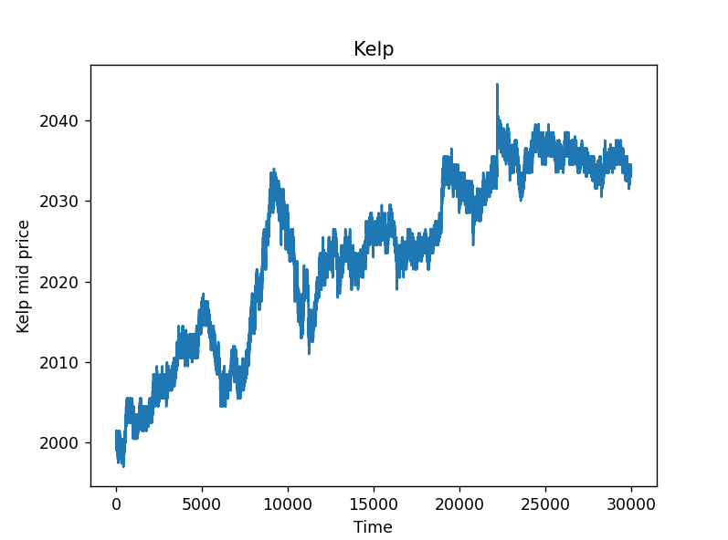
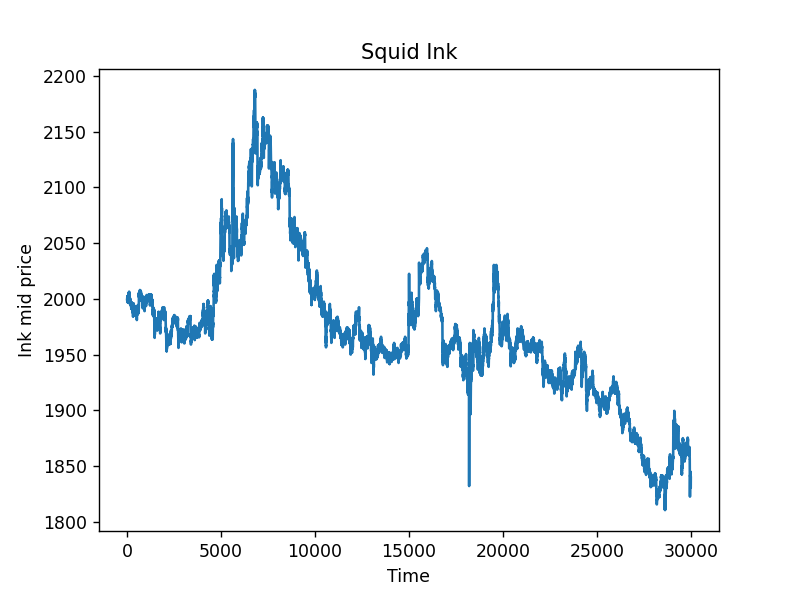
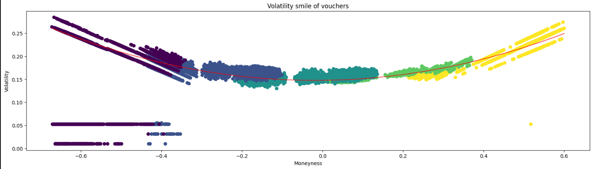

# IMC Prosperity 3

## Introduction
IMC Prosperity 3 was an algorithmic trading competition, with over 12,000 teams competing globally. In the competition, we were tasked with trading a wide range of different assets, aiming to maximise our seashells — the currency of the island. At first, we traded Squid Ink, Kelp, and Rainforest Resin, with more assets being added in each subsequent round. At the end of each round, our strategy was evaluated against bot participants, whose behaviour could be predicted through historical data, simulating an actual marketplace. The PNL from this evaluation would then be compared against every other team in the competition.  
  
In addition to the algorithmic section, there was also a manual trading challenge in each round.

This write-up shares our algorithms that placed us 101st in IMC Prosperity, and 8th in the UK (top 0.8% globally). In this report, we will explain the strategies that we used, as well as show some of the research which led to them.

<h2>Round 1️⃣</h2>

In round 1, we had 3 assets to trade: Rainforest Resin, Kelp, and Squid Ink.  
<h4>Rainforest Resin</h4>
Rainforest Resin was a relatively stable asset, with a price deviating at most 2–3 seashells from 10,000. Therefore, we created our algorithm to trade against bids below 10,000 and asks above 10,000 with a certain edge, which we optimised using a backtester and historical data.  
  
During testing, we realised that a large number of profitable trades were not being executed due to position limits, so we implemented a position-clearing algorithm to move our position closer to 0 so that more profitable trades could subsequently be executed. We also made markets with remaining liquidity around the fair value of 10,000, dynamically adjusting the width of the market based on the other prices set by other market makers for additional profits.
  
<h4>Kelp</h4>
Kelp was less simple to model, hence we had more difficulty finding a fair price. However, when analysing the graph (pictured below), we realised that the price followed a mean-reverting process with a drift term. Thus, we considered short-term simple moving averages and used these to shift the price towards this average. Additionally, we realised that there was a small negative correlation between Ink and Kelp, which we used to aid our model to find the fair price.
  
Additionally, taking inspiration from successful teams in previous years, including Linear Unity, we found that a more stable mid-price was obtained by using higher-volume orders. Combining this with the strategies above gave us a good estimate for the fair price. We did this for every asset throughout the competition (except for Resin).
  
We then traded Kelp in much the same way as Resin, but replacing 10,000 with the fair price estimate obtained by the methods detailed above, with hyperparameters optimised using the backtester.  
 

 

  <em>Kelp and Ink prices across the 3 days of historic data available</em>

<h4>Ink</h4>
As is clear from the image above, Ink had large spikes in price. Therefore, we created a trading strategy to take advantage of this by considering the difference between the current price and a simple moving average of the price, and trading based on an expectation of reverting to a price close to the pre-spike level. Additionally, we used short-term mean reversions again to better capture the movements of the price.
  
Just as with previous assets, we used a combination of making, taking, and clearing orders to make a profit. Unfortunately, our strategy on Ink in this round wasn't as successful as we had hoped, but with further refinements during later rounds, we managed to obtain consistently higher profits.

<h2>Round 2️⃣</h2>

<h4>Baskets</h4>
In this round, three new assets were added (Jams, Djembas, and Croissants). We were also given access to Picnic Baskets containing these assets, with Basket 1 containing all three, and Basket 2 only containing Croissants and Jams.  
  
For this asset, we implemented a strategy based on z-scores. If the z-score exceeded a certain threshold, we would trade the basket, expecting it to return to the mean. We then used an artificial basket trading strategy to hedge these orders — so if we bought a basket, we would sell its components in equal quantities as within the basket.
  
However, we found that the volatility of the baskets was not at all constant. Therefore, we decided to use a short-term standard deviation with a fixed mean, and a fixed threshold on the z-score for trading. When the volatility significantly dropped, the z-score spiked, so we were able to trade much closer to local extrema than with the fixed-volatility z-score strategy above.

<h2>Round 3️⃣</h2>

<h4>Volcanic Rock and Vouchers</h4>
In this round, we were introduced to Volcanic Rock and Vouchers, which are essentially options. There were 5 different vouchers at different strike prices (9500, 9750, 10,000, 10,250, 10,500). We initially began by using the Black-Scholes model to try and find imbalances between the option price and what we would expect it to be.  

However, we found this to not be especially successful and were struggling to price the options until IMC released a hint, which encouraged us to consider the volatility smile.
  

<em>Volatility smile of all vouchers</em>

  
We then started creating our trading strategy. We found Implied Volatility (IV) using the Black-Scholes model and compared that to a local standard deviation. If IV was significantly larger than the local standard deviation, we would buy the voucher, and if the local standard deviation was significantly larger than IV, we would short the voucher. We used a threshold to decide if the difference was significant enough, and we found through testing that a hard-coded threshold was more reliable than an adaptive threshold.
  
We also tried to use delta hedging, but this did not work especially well with the 10,000 voucher, so we decided to embrace the higher risk of delta exposure for this voucher. In this round, we only traded the one voucher because we only began creating the volatility trading strategy on the final day, so we didn't have enough time to be confident with any of the other vouchers.  
  
Additionally, it is worth noting that the vouchers had a 7-day expiry, so we needed to consider the effect of theta decay on the prices. While this was not too much of a concern for the 10,000 voucher, as the price of Volcanic Rock never deviated too far from it, it did cause us issues when we traded the other vouchers in later rounds.

<h2>Round 4️⃣</h2>

<h4>Magnificent Macarons</h4>
In this round, we were introduced to a commodity — macarons. We were also given data relating to sugar prices and sunlight. However, as macarons are a physical commodity, they have shipping and storage fees, as well as import and export tariffs.  
We began by looking for alpha in all of the data we were given, as well as performing cross-exchange arbitrage in order to obtain risk-free profits.  
  
Halfway through this round, we again used the hint given to us by IMC. They mentioned that the correlation between sugar prices and macarons was high if sunlight was below a certain index, so we used this to trade macarons. When the sunlight was low, we shorted the macarons — unless the sunlight was rapidly increasing closer to the index — as we would get a lower price because sugar was cheaper in lower sunlight. If the sunlight was above this index, we used a z-score strategy to decide when to trade, again using mean reversion.
  
We also made and cleared markets on macarons for additional profits — but only when the volatility of macarons was low. Otherwise, we were sometimes providing bids above the fair price of macarons, or asks below!
  
We also tried to trade the other vouchers in this round; however, we did not consider quite how powerful theta decay would be. This led to us trading all of the vouchers, yet many of them did not make a profit and, in fact, lost us seashells on the final evaluation because of this.

<h2>Round 5️⃣</h2>

<h4>Bots Identified</h4>
In this round, the bots we had been trading against for the duration of this competition were finally revealed to us, along with their trading ethos. We programmed a large backtesting tool which found the highest-performing bots on every asset. We found out that Olivia always bought at the lowest price in the day and sold at the highest on Squid Ink and Croissants. Therefore, we followed her trades on these assets.  
  
As Croissants were part of a larger basket, we then traded artificial Croissants, matching Olivia’s trading. This allowed us to significantly improve our strategies for these baskets, leading to much better and far stabler profits.  
  
Furthermore, we significantly decreased the range of vouchers we were trading, only trading 9750 and 10,000, as we believed these would be affected the least by theta decay. We again didn’t hedge these — which perhaps was a poor decision given there were only two more days until expiry.  
  
After this round, we ended the competition in 101st, narrowly missing out on the coveted top 100 places. As a team, we've really enjoyed taking part in this competition, and can't wait to push into these higher positions next year in Prosperity 4!

